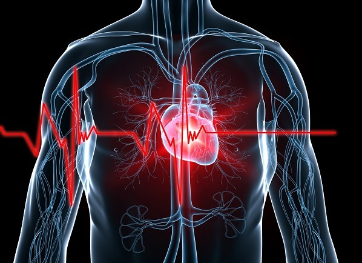
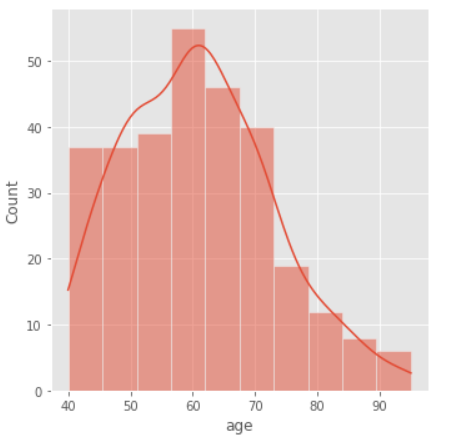
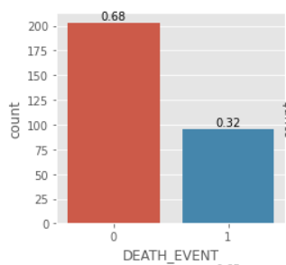
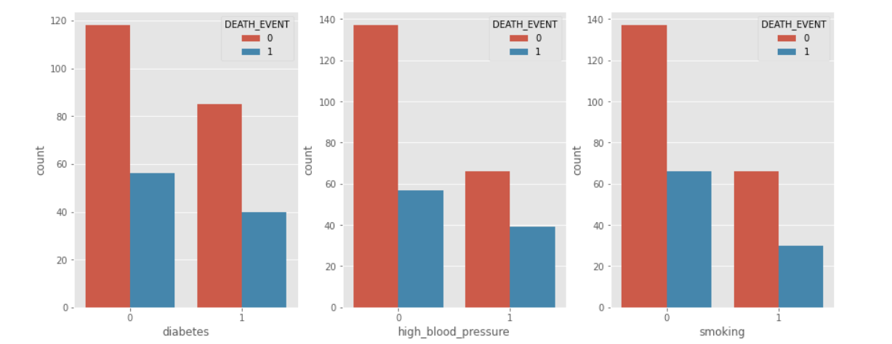
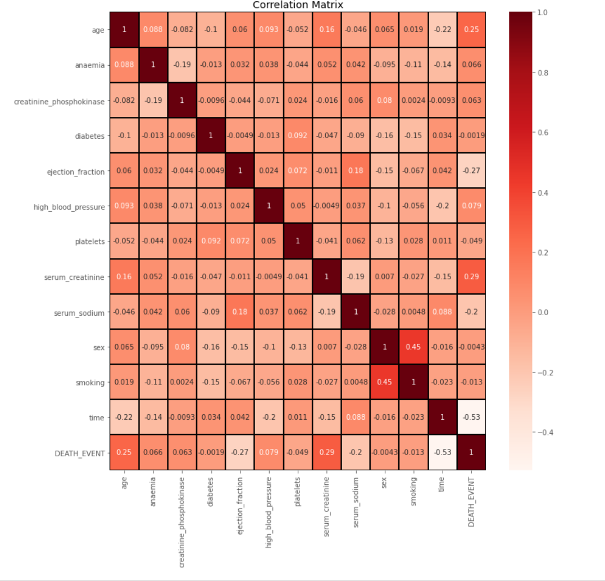
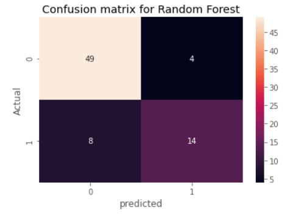
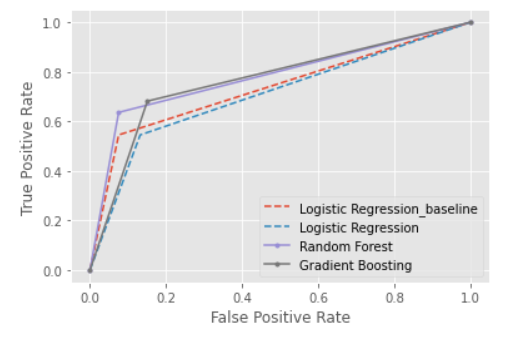
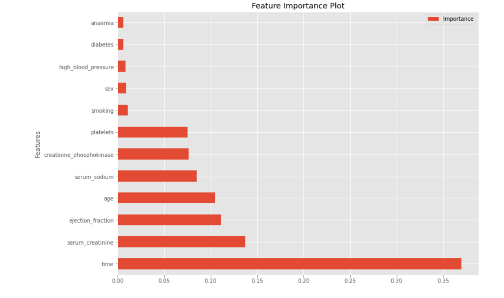

# Predicting Heart Failure Survival

### Problem Definition

Heart failure, also known as congestive heart failure, occurs when our heart muscle doesn't pump blood as well as it should. Its  one of the leading cause of death globally, taking estimated 17 million lives each year. Certain conditions, such as narrowed arteries in our heart (coronary artery disease) or high blood pressure, gradually leave your heart too weak or stiff to fill and pump efficiently.

Not all conditions that lead to heart failure can be reversed, but treatments if started in time, can improve the signs and symptoms of heart failure and help us live longer. Lifestyle changes — such as exercising, reducing sodium in your diet, managing stress and losing weight — can improve our quality of life.

Dataset of 299 patients and 13 features was chosen for this study. Machine Learning classifiers were applied to predict patient survival and rank the features corresponding to the most important risk factors.

Death event feature was the target in this binary classification study, suggested if the patient survived or died before the end of the follow up time, which was 130 days on average.  
In the dataset, patients those were alive (death event = 0) were 203, while the patients who were dead (death event = 1) were 96 constituting 67.89% and 32.11% respectively. 

### Data Collection

heart_failure_clinical_records_dataset.csv :Dataset was loaded to pandas dataframe and analysed. The dataset consisted of data from 299 patients for 13 variables. DEATH_EVENT was target variable, 6 numerical and 6 categorical variables.

### Clean Data
 This dataset was pretty clean. Dataset did not have duplicates or null values.
 
### Exploratory Data Analysis

                                               

Observations:
* Age distribution for most patients was between 40 and 70. Death event ocurred more among patient of old ages.
* No significant difference between diabetic or non diabetic patient when related with death event.
* Likewise smoking and High blood pressure showed no significant association with Death event.
* No association between gender and death event. 
* Increase of death event was noted among patients who had ejection fraction of 30% or less. 

### Model Evaluation AND Best Model Selection

Numeric variables were scaled using MinMaxScaler. Data was then split into train and test data for model creation and evaluation process. Evaluation metric we chose were Accuracy score, F1 score and AUC value.

 #### Baseline
* Logistic Regression baseline:  Linear Regression model with default parameter was used to get the base line prediction. 

 #### Models
* Logistic Regression (with Hyperparameter tuning): Explored GridSearchCV to find best parameters and got F1 score of 59% and accuracy of 77%. There were 7 False positives.
* Random Forest : GridSearchCV was used to hypertune and got F1 score of 70% and accuracy of 84%. There were 4 False positives.
* Gradient Boosting: GridSearchCV was used to hypertune and got F1 score of 67% and accuracy of 80%.

                                                  

#### Selecting the Best model

 Random forest model gave the best F1 score of 70%, highest accuracy of 84 and also had best AUC value. Hence it was selected as the best model.
 Feature importance was computed using random forest classifier and important variables were ploted.
 
 
 
 ### Conclusion:
 
In machine learning our goal is to minimize Type I (FP) and Type II errors(FN).In an ideal case, a perfect model should have none of these errors. However practically no error is impossible and depending on the context we handle these errors differently. In our context, with the best model, we still had 4 FP cases and 8 FN cases. We had accuracy of 85%, recall of 64% and F1 score 72%.

Our best model would be the one with high specificity and least False Positive Rate which would minimize the possibility of missing patients who need precautionary measures or prophylaxis for heart failure.

Addition of additional features and additional data might improve model predictions for future studies.

### References:

1. https://bmcmedinformdecismak.biomedcentral.com/articles/10.1186/s12911-020-1023-5

2.https://www.analyticsvidhya.com/blog/2020/09/precision-recall-machine-learning/
